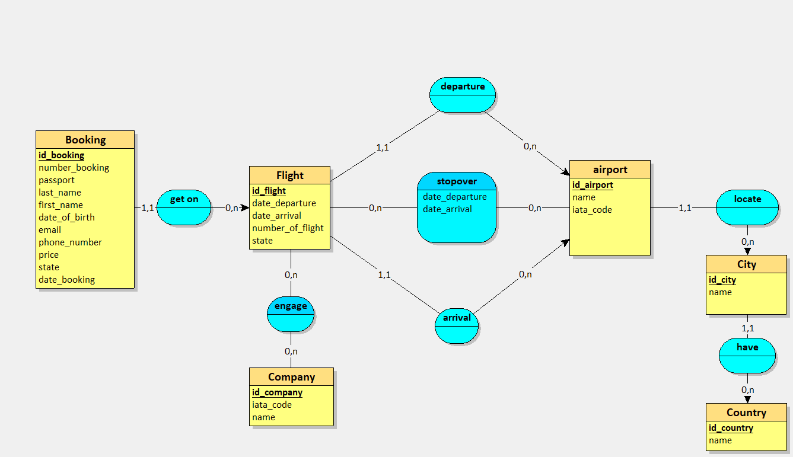
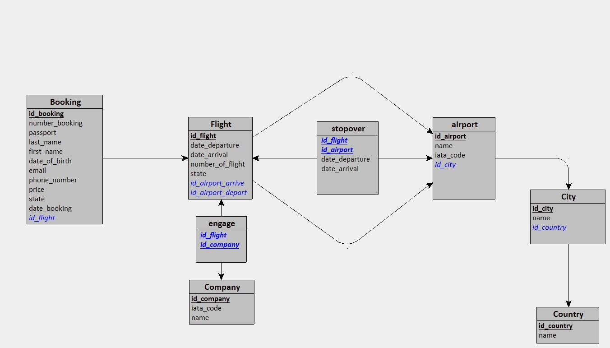
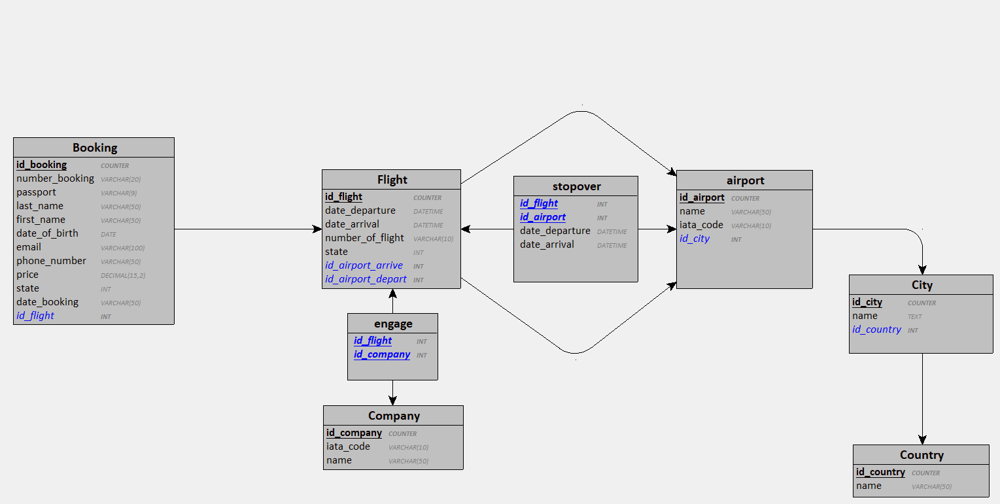
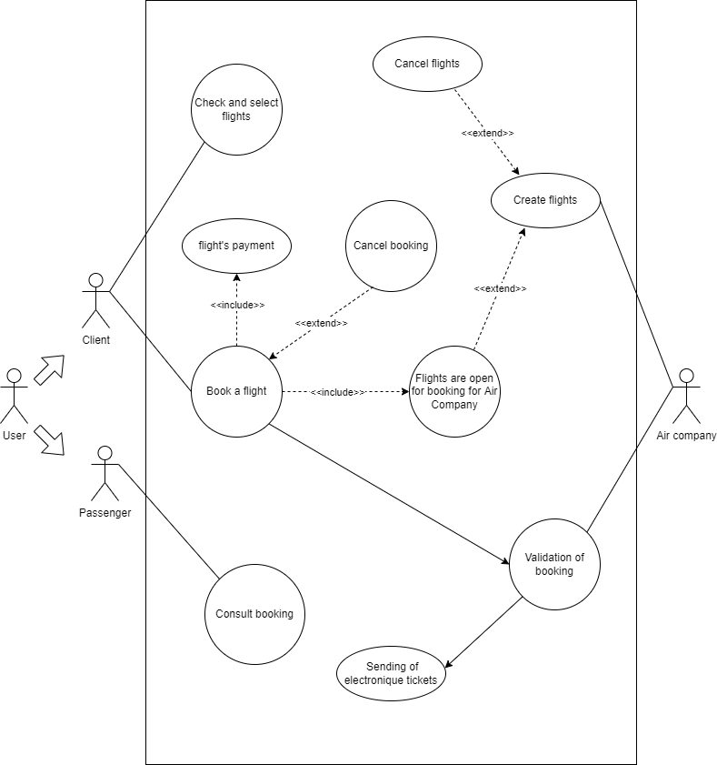
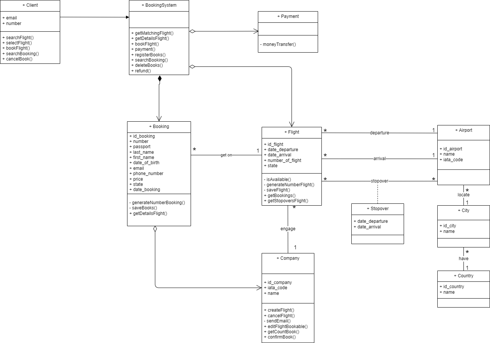
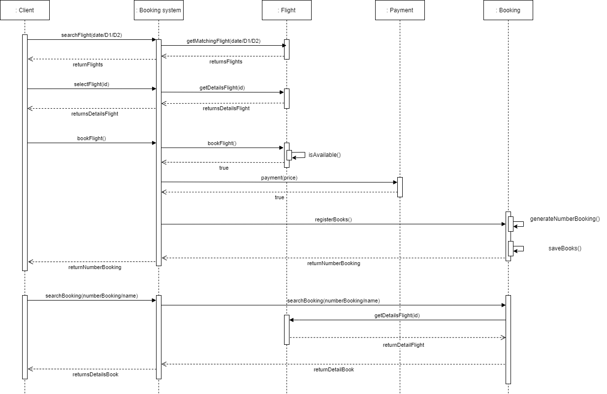

# Conception de la base de données

## Table des mattiere
1. [Contexte du projet](#contexte-du-projet)
2. [Critères de performance](#critères-de-performance)
3. [Livrable](#livrable)  
   3.1. [Pour la base de données](#pour-la-base-de-données)  
   3.2. [Pour l'application](#pour-lapplication)
4. [Règles de gestion](#règles-de-gestion)
5. [Dictionnaire de données](#dictionnaire-de-données)
6. [Modèle Conceptuel des Données](#modèle-conceptuel-des-données)
7. [Modèle Logique des Données](#modèle-logique-des-données)
8. [Modèle Physique des Données](#modèle-physique-des-données)
9. [UML (Unified Modeling Language)](#uml-unified-modeling-language)  
   9.1. [Diagramme use case](#diagramme-use-case)  
   9.2. [Diagramme de classe](#diagramme-de-classe)  
   9.3. [Diagramme de séquence](#diagramme-de-séquence)  
10. [Source](#source)


## Contexte du projet

Votre client, une agence de voyages, souhaite proposer la possibilité de réserver en ligne des billets d'avion à leurs clients.
Votre mission est de concevoir à l'aide du standard UML la modélisation de la plateforme.
La plateforme devra permettre que :

- Un vol est ouvert à la réservation et refermé sur ordre de la compagnie.
- Un vol peut être annulé par la compagnie
- Un client peut réserver un ou plusieurs vols, pour des passagers différents.
- Une réservation concerne un seul vol et un seul passager.
- Une réservation peut être annulée ou confirmée.
- Un vol a un aéroport de départ et un aéroport d’arrivée.
- Un vol a un jour et une heure de départ, et un jour et une heure d’arrivée.
- Un vol peut comporter des escales dans des aéroports.
- Une escale a une heure d’arrivée et une heure de départ.
- Chaque aéroport dessert une ou plusieurs villes.
- Des compagnies aériennes proposent différents vols.

## Critères de performance

Un readme répertoriant les informations principales.
Tous les diagrammes doivent correspondre à la notation officielle du standard UML et Merise
Les diagrammes doivent être exportés en format images facilement consultables (jpeg, png).
Minimum d'un commit par diagramme.

La conception Merise doit respecter au minimum les 3 premières formes normales.

## Livrable

### Pour la base de données

- [x] Un MCD,
- [x] Un MLD,
- [x] Un MPD.

### Pour l'application

- [x] Un dictionnaire de données,
- [x] Des règles de gestion,
- [x] Un diagramme de cas d'utilisation,
- [x] Un diagramme de classe,
- [x] Un diagramme de séquence.

## Règles de gestion

### Client

- Peut réserver pour un ou plusieurs passagers.

### Réservation

- Concerne qu'un seul vol et un seul passager,
- Peut être annulée ou confirmée,
- Contient un numéro de réservation,
- Contient un nom, prénom et numéro de téléphone.

### Vol

- Contient un numéro de vol,
- Contient un aéroport de départ, une date et une heure,
- Contient un aéroport d'arrivée, une date et une heure,
- Contient un ou plusieurs passagers,
- Peut être ouvert à la réservation ou non par la compagnie,
- Peut être annulé par la compagnie,
- Peut faire des escales dans un aéroport,
- Est un trajet d'un aéroport de départ à un aéroport d'arrivé.

### Aéroport

- Se trouve dans une ville.

### Escale

- Se fait dans un aéroport,
- Contient une date et une heure d'arrivée,
- Contient une date et une heure de départ.

### Compagnie

- Propose différents vols,
- Contient un nom.

### Ville

- Contient un nom.

### Pays

- Contient un nom.

## Dictionnaire de données

| Code mnémonique         | Désignation                                                                                          | Type | Taille | Remarque                       |
| ----------------------- | ---------------------------------------------------------------------------------------------------- | ---- | ------ | ------------------------------ |
| number_booking          | Numéro de réservation                                                                                | AN   | 20     |                                |
| passeport_booking       | Code d'identification du passager                                                                    | AN   | 9      |                                |
| last_name_booking       | Nom du passager                                                                                      | A    | 50     |                                |
| first_name_booking      | Prénom du passager                                                                                   | A    | 50     |                                |
| date_of_birth_booking   | Âge du passager                                                                                      | DATE |        | Au format AAAA-JJ-MM           |
| email_booking           | Mail du passager ou d'un contact pour envoyer des documents par exemple : envoyer le billet          | AN   | 100    |                                |
| phone_number_booking    | Téléphone du passager ou de contact                                                                  | AN   | 15     |                                |
| price_booking           | Prix du vol                                                                                          | N    | 15     |                                |
| state_booking           | Définit le statut de la réservation, en attente, confirmer par la compagnie, annuler par le passager | N    |        |                                |
| date_booking            | Date de la réservation                                                                               | DATE |        | Au format AAAA-JJ-MM           |
| date_departure_flight   | Date et l'heure du départ du vol                                                                     | DATE |        | Au format AAAA-JJ-MM h : m : s |
| date_arrival_flight     | Date et l'heure du arrivée du vol                                                                    | DATE |        | Au format AAAA-JJ-MM h : m : s |
| number_of_flight        | Numéro d'identification du vol                                                                       | AN   | 10     |                                |
| state_flight            | Définit le statut du vol, annuler, ouvert, fermer                                                    | N    |        |                                |
| date_departure_stopover | Date et l'heure du départ de l'escale                                                                | DATE |        | Au format AAAA-JJ-MM h : m : s |
| date_arrival_stopover   | Date et l'heure du arrivée de l'escale                                                               | DATE |        | Au format AAAA-JJ-MM h : m : s |
| name_company            | Nom de la compagnie                                                                                  | AN   | 50     |                                |
| iata_code_company       | Identifiant de la compagnie aérienne                                                                 | AN   | 10     |                                |
| nom_airport             | Nom de l'aéroport                                                                                    | A    | 50     |                                |
| iata_code_airport       | Identifiant de localisation                                                                          | AN   | 10     |                                |
| name_city               | Nom d'une ville                                                                                      | A    | 50     |                                |
| name_country            | Nom d'un pays                                                                                        | A    | 50     |                                |

## Modèle Conceptuel des Données
Cliquer sur le MCD pour l'atteindre :

[](./databaseDesign/MCD.png)

## Modèle Logique des Données

\***\*Modèle Logique des Données textuel:\*\***

**Company** = (**id_company** COUNTER, iata_code VARCHAR(10), name VARCHAR(50));  
**Country** = (**id_country** COUNTER, name VARCHAR(50));  
**City** = (**id_city** COUNTER, name TEXT, **#id_country**);  
**airport** = (**id_airport** COUNTER, name VARCHAR(50), iata_code VARCHAR(10), **#id_city**);  
**Flight** = (**id_flight** COUNTER, date_departure DATETIME, date_arrival DATETIME, number_of_flight VARCHAR(10), state INT, **#id_airport_arrive**, **#id_airport_depart**);  
**Booking** = (**id_booking** COUNTER, number_booking VARCHAR(20), passport VARCHAR(9), last_name VARCHAR(50), first_name VARCHAR(50), date_of_birth DATE, email VARCHAR(100), phone_number VARCHAR(50), price DECIMAL(15,2), state INT, date_booking VARCHAR(50), **#id_flight**);  
**engage** = (**#id_flight**, **#id_company**);  
**stopover** = **(#id_flight**, **#id_airport**, date_departure DATETIME, date_arrival DATETIME);  


Cliquer sur le MLD pour l'afficher :

[](./databaseDesign/MLD.jpg)

## Modèle Physique des Données

Cliquer sur le MPD pour l'afficher :

[](./databaseDesign/MPD.png)

```sql
CREATE TABLE Company(
  id_company COUNTER,
  iata_code VARCHAR(10),
  name VARCHAR(50),
  PRIMARY KEY(id_company)
);

CREATE TABLE Country(
  id_country COUNTER,
  name VARCHAR(50),
  PRIMARY KEY(id_country)
);

CREATE TABLE City(
  id_city COUNTER,
  name TEXT,
  id_country INT NOT NULL,
  PRIMARY KEY(id_city),
  FOREIGN KEY(id_country) REFERENCES Country(id_country)
);

CREATE TABLE airport(
  id_airport COUNTER,
  name VARCHAR(50),
  iata_code VARCHAR(10),
  id_city INT NOT NULL,
  PRIMARY KEY(id_airport),
  FOREIGN KEY(id_city) REFERENCES City(id_city)
);

CREATE TABLE Flight(
  id_flight COUNTER,
  date_departure DATETIME,
  date_arrival DATETIME,
  number_of_flight VARCHAR(10),
  state INT,
  id_airport_arrive INT NOT NULL,
  id_airport_depart INT NOT NULL,
  PRIMARY KEY(id_flight),
  FOREIGN KEY(id_airport_arrive) REFERENCES airport(id_airport),
  FOREIGN KEY(id_airport_depart) REFERENCES airport(id_airport)
);

CREATE TABLE Booking(
  id_booking COUNTER,
  number_booking VARCHAR(20),
  passport VARCHAR(9),
  last_name VARCHAR(50),
  first_name VARCHAR(50),
  date_of_birth DATE,
  email VARCHAR(100),
  phone_number VARCHAR(50),
  price DECIMAL(15,2),
  state INT,
  date_booking VARCHAR(50),
  id_flight INT NOT NULL,
  PRIMARY KEY(id_booking),
  FOREIGN KEY(id_flight) REFERENCES Flight(id_flight)
);

CREATE TABLE engage(
  id_flight INT,
  id_company INT,
  PRIMARY KEY(id_flight, id_company),
  FOREIGN KEY(id_flight) REFERENCES Flight(id_flight),
  FOREIGN KEY(id_company) REFERENCES Company(id_company)
);

CREATE TABLE stopover(
  id_flight INT,
  id_airport INT,
  date_departure DATETIME,
  date_arrival DATETIME,
  PRIMARY KEY(id_flight, id_airport),
  FOREIGN KEY(id_flight) REFERENCES Flight(id_flight),
  FOREIGN KEY(id_airport) REFERENCES airport(id_airport)
);
```

## UML (Unified Modeling Language)

### Diagramme use case

Cliquer sur le diagramme pour l'afficher :

[](./UML/diagrammeUseCase.png)

### Diagramme de classe
Cliquer sur le diagramme pour l'afficher :

[](./UML/diagrammeDeClasse.drawio.png)

### Diagramme de séquence
Cliquer sur le diagramme pour l'afficher :

[](./UML/DiagrammeDeSequence.drawio.png)


## Source

### sites internet
- https://ineumann.developpez.com/tutoriels/merise/initiation-merise/  
- https://creately.com/blog/fr/uncategorized-fr/tutoriel-sur-les-diagrammes-de-classe/  
- http://grand.patrice.free.fr/net/courscharp/chap4/

### Vidéos youtube
- https://www.youtube.com/watch?v=GC5BdRve38A&ab_channel=DelphineLonguet  
- https://www.youtube.com/watch?v=8VMMu-vcF60&t=407s&ab_channel=DelphineLonguet  
- https://www.youtube.com/watch?v=fPm5NrvmXHc&t=771s&ab_channel=DelphineLonguet  


*Ce projet a été réalisé en travail de groupe par :*
- ***Yacine Ponsot***
- ***Sébastien Mouret***
- ***Julie Napoli***